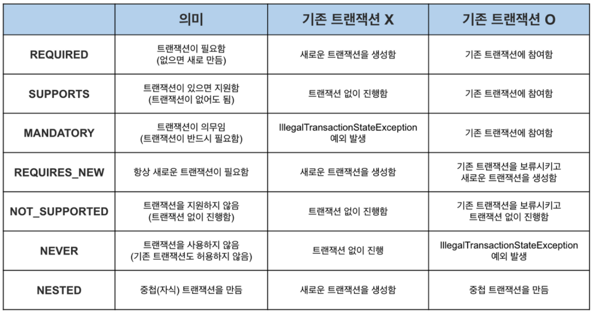

# 스프링 고급 
## advanced  
  - ThreadLocal
  - Design Pattern
      - TemplateMethod Pattern
      - Strategy Pattern
      - TemplateCallback Pattern
  -  AOP
      - AOP_LOG_TRACER
  -  Transaction
      - Spring Transaction

# ThreadLocal  
### 예제  
hello.advanced.v3  

  ### 설명  
  해당 쓰레드만 접근할 수 있는 특별한 저장소를 말한다.  
  자바는 언어 차원에서 ThreadLoal을 지원하기 위한 java.lang.ThreadLocal을 제공한다.  
    
  ### 사용법
  private ThreadLocal<String> nameStore = new ThreadLocal<>();  
  값 저장: ThreadLocal.set(xxx)  
  값 조회: ThreadLocal.get()  
  값 제거: ThreadLocal.remove()  
  
  ### 주의 사항  
해당 쓰레드가 쓰레드 로컬을 모두 사용하고 나면 ThreadLocal.remove() 를 호출하여 쓰레드 로컬에 저장된 값을 제거해주어야 한다.  
쓰레드 로컬의 값을 사용 후 제거하지 않고 그냥 두면 WAS 처럼 쓰레드 풀을 사용하는 경우 심각한 문제를 발생 할 수 있다.  
  
시나리오 ex)
사용자 A 저장 요청
>  사용자 A가 저장 HTTP를 요청했다. -> WAS는 Thread pool에서 Thread를 하나 조회한다. -> ThreadA 할당되었다.  -> ThreadA는 사용자A의 데이터를 ThreadLocal에 저장한다. -> ThreadLocal의 ThreadA 전용 저장소에 사용자 A의 데이터를 보관한다.  
  
사용자A 저장 요청 종료
  > 사용자A의 HTTP 응답이 끝난다. -> WAS는 사용이 끝난 ThreadA를 Thread pool에 반환한다. (Thread를 생성하는 비용은 비싸기 때문에 보통 Thread를 제거하지 안고
                풀을 통해 재사용한다.) -> ThreadA는 Thread pool에 아직 살아있다. 따라서 ThreadLocal의 ThreadA 전용 보관소에 사용자 A의 데이터도 함께 살아있게 된다.

이 후 A를 제외한 사용자 조회 요청
>   HTTP 요청 -> WAS Thread pool 에서 Thread 조회 -> ThreadA 할당 -> ThreadA ThreadLocal 데이터 조회
                -> ThreadLocal ThreadA 보관소에 있는 사용자A 값 반환

위와 같은 문제를 야기 할 수 있으므로, 쓰레드 로컬은 사용이 종료되면 꼬오오옥 remove() 호출해 줘야한다.  

  
# 2.Design Pattern 
## 2-1 Template Method Pattern
### 예제  
hello.advanced.v4  
test.java.hello.advanced.trace.hellotrace.template  

  

  ### 설명  
부모 클래스에 알고리즘의 골격인 템플릿을 정의하고, 일부 변경되는 로직은 자식 클래스에 정의하는  
것이다.   
이렇게 하면 자식 클래스가 알고리즘의 전체 구조를 변경하지 않고, 특정 부분만 재정의할 수 있다.    
결국 상속과 오버라이딩을 통한 다형성으로 문제를 해결하는 것이다.

### 문제 
 템플릿 메서드 패턴은 상속을 사용한다. 따라서 상속에서 오는 단점들을 그대로 안고간다. 특히 자식  
 클래스가 부모 클래스와 컴파일 시점에 강하게 결합되는 문제가 있다. 이것은 의존관계에 대한 문제이다.  
 자식 클래스 입장에서는 부모 클래스의 기능을 전혀 사용하지 않는다. 
 
 자식 클래스 입장에서는 부모 클래스의 기능을 전혀 사용하지 않는데, 부모 클래스를 알아야한다. 이것은  
 좋은 설계가 아니다. 그리고 이런 잘못된 의존관계 때문에 부모 클래스를 수정하면, 자식 클래스에도 영향을  
 줄 수 있다.  
      
 상속을 받는 다는 것은 특정 부모 클래스를 의존하고 있다는 것이다. 자식 클래스의 extends 다음에 바로  
 부모 클래스가 코드상에 지정되어 있다.  
   
  따라서 부모 클래스의 기능을 사용하든 사용하지 않든 간에 부모 클래스를 강하게 의존하게 된다.  
  
  
-해결 방안  
 전략 패턴(Strategy Pattern)

## 2-2.Strategy Pattern 
### 예제  
test.java.hello.advanced.trace.hellotrace.strategy

  ### 설명  
전략 패턴은 변하지 않는 부분을 Context 라는 곳에 두고, 변하는 부분을 Strategy 라는 인터페이스를  
만들고 해당 인터페이스를 구현하도록 해서 문제를 해결한다. 상속이 아니라 위임으로 문제를 해결하는 것이다.  
전략 패턴에서 Context 는 변하지 않는 템플릿 역할을 하고, Strategy 는 변하는 알고리즘 역할을 한다.  
  
전략 패턴의 핵심은 Context 는 Strategy 인터페이스에만 의존한다는 점이다. 덕분에 Strategy 의  
구현체를 변경하거나 새로 만들어도 Context 코드에는 영향을 주지 않는다.  
      
스프링에서 의존관계 주입에서 사용하는 방식이 바로 전략 패턴이다.

## 2-3.TemplateCallback Pattern 
### 예제  
hello.advanced.v5  
test.java.hello.advanced.trace.hellotrace.strategy.callback    

  ### 설명
Strategy Pattern에서 Context 가 템플릿 역할을 하고, Strategy 부분이 콜백으로 넘어온다 생각하면 된다.  
 참고로 템플릿 콜백 패턴은 GOF 패턴은 아니고, 스프링 내부에서 이런 방식을 자주 사용하기 때문에, 스프링 안에서만 이렇게 부른다.    
 
  전략 패턴에서 템플릿과 콜백 부분이 강조된 패턴이라 생각하면 된다.  
 스프링에서는 JdbcTemplate , RestTemplate , TransactionTemplate , RedisTemplate 처럼 다양한 템플릿 콜백 패턴이 사용된다.   
 
 스프링에서 이름에 XxxTemplate 가 있다면 템플릿 콜백 패턴으로 만들어져 있다 생각하면 된다.  

# 3.AOP
### 설명
여러 클래스에 걸쳐서 함께 사용되는 부가 기능인 횡단 관심사(cross-cutting concerns)  
Aspect를 사용한 프로그래밍 방식(Aspect-Oriented Programing)
-    ※Aspect :부가 기능과 부가 기능을 어디에 적용할지 선택하는 기능을 하나로 합쳐, 모듈로 만든것
    스프링이 제공하는  어드바이저도 어드바이스(부가기능)과 포인트컷(적용 대상)을 가지고 있으므로, 하나의 애스펙트 이다.  
    
AOP는 OOP를 대체하기 위한 것이 아니라 횡단 관심사를 깔끔하게 처리하기 어려운 OOP의 부족한 부분을 보조하는 목적으로 개발되었다.

### AspectJ Framework
AOP의 대표적인 구현으로 AspectJ Framework가 있다.   
스프링도 AOP를 지원하지만 대부분 AspectJ의 문법을 차용하고, AspectJ가 제공하는 기능의 일부만 제공한다.
*스프링은 AspectJ를 직접 사용하는 것이 아니라 AspectJ의 문법을 차용하고, Proxy 방식의 AOP를 적용한다.
https://www.eclipse.org/aspectj/

### AOP 적용 방식
#### 컴파일 시점
.java 소스 코드를 컴파일러를 사용해서 .class 를 만드는 시점에 부가 기능 로직을 추가할 수 있다. 이때는 AspectJ가 제공하는 특별한 컴파일러를 사용해야 한다. 컴파일 된 .class 를 디컴파일 해보면 애스펙트 관련 호출 코드가 들어간다.	

#### 클래스 로딩 시점
자바를 실행하면 자바 언어는 .class 파일을 JVM 내부의 클래스 로더에 보관한다. 이때 중간에서 .class 파일을 조작한 다음 JVM에 올릴 수 있다. 자바 언어는 .class 를 JVM에 저장하기 전에 조작할 수 있는 기능을 제공한다.

#### 런타임 시점(Proxy)
런타임 시점은 컴파일도 다 끝나고, 클래스 로더에 클래스도 다 올라가서 이미 자바가 실행되고 난 다음을 말한다. 자바의 메인( main ) 메서드가 이미 실행된 다음이다. 따라서 자바 언어가 제공하는 범위 안에서 부가 기능을 적용해야 한다.  --> 스프링에서 제공하는 AOP 실행 시점

### AOP 적용 위치
AspectJ 프레임워크를 사용하는 경우 조인 포인트를 생성자, 필드 값 접근, static 메서드, 메서드 실행 등으로 설정할 수 있지만, Spring 프레임워크에서 제공하는 AOP는 AspectJ프레임워크를 직접 사용하지 않고,Proxy 방식을 사용하기 때문에 조인 포인트가 메서드 실행으로 제한 된다.

### AOP 기초 용어
#### 조인 포인트(Join point):
 어드바이스가 적용될 수 있는 위치, 메소드 실행, 생성자 호출, 필드 값 접근, static 메서드 접근 같은 프로그램 실행 중 지점 조인 포인트는 추상적인 개념이다. AOP를 적용할 수 있는 모든 지점이라 생각하면 된다.  
####  포인트컷(Pointcut) :
예) 
@Pointcut("execution(* hello.aop.order..*Repository(..))"  
execution(접근제어자? 반환타입 선언타입?메서드이름(파라미터) 예외?)  
  
조인 포인트 중에서 어드바이스가 적용될 위치를 선별하는 기능 주로 AspectJ 표현식을 사용해서 지정 프록시를 사용하는 스프링 AOP는 메서드 실행 지점만 포인트컷으로 선별 가능 
#### 타켓(Target):
 어드바이스를 받는 객체, 포인트컷으로 결정   
 
#### 어드바이스(Advice):
 부가 기능 특정 조인 포인트에서 Aspect에 의해 취해지는 조치 Around(주변), Before(전), After(후)와 같은 다양한 종류의 어드바이스가 있음 
#### 애스펙트(Aspect):
 어드바이스 + 포인트컷을 모듈화 한 것 @Aspect 를 생각하면 됨 여러 어드바이스와 포인트 컷이 함께 존재  
 
#### 어드바이저(Advisor)
하나의 어드바이스와 하나의 포인트 컷으로 구성 스프링 AOP에서만 사용되는 특별한 용어 

#### 위빙(Weaving):
 포인트컷으로 결정한 타켓의 조인 포인트에 어드바이스를 적용하는 것 위빙을 통해 핵심 기능 코드에 영향을 주지 않고 부가 기능을 추가 할 수 있음 AOP 적용을 위해 애스펙트를 객체에 연결한 상태 
 
#### AOP 프록시:
 AOP 기능을 구현하기 위해 만든 프록시 객체, 스프링에서 AOP 프록시는 JDK 동적 프록시 또는 CGLIB 프록시이다

## 3-1. AOP 로그 추적기 (AOP_LOG_TRACER)
#### (hello.toy.logTrace.정리.txt)    
#### 위치 : hello.toy.logTrace  
#### Spring AOP를 활용해서 만든 Log 추적기호출기  
#### 각각의 Layer Level을 표현을 구현하기 위해 ThreadLocal을 사용해서 각 Thread마다 쓰레드 지역 변수를 가질 수 있도록 했다.  
#### 로그 추적 결과 :
[ID]  level 이동 그림,  메소드 위치, level, (예외 발생시) 예외 정보  
#### (정상 호출)
  

[e3991604]   --> , location : String hello.toy.LogTrace.LogTraceController.tt(), level : 1  
[e3991604]  |   | --> , location : String hello.toy.LogTrace.TestService.t1(), level : 2  
[e3991604]  |   ||   | --> , location : String hello.toy.LogTrace.TestService.t2(), level : 3  
[e3991604]  |   ||   ||   | --> , location : String hello.toy.LogTrace.TestRepository.t3(), level : 4  
[e3991604]  |   ||   ||   | <-- , location : String hello.toy.LogTrace.TestRepository.t3(), level : 4  
[e3991604]  |   ||   | <-- , location : String hello.toy.LogTrace.TestService.t2(), level : 3  
[e3991604]  |   | <-- , location : String hello.toy.LogTrace.TestService.t1(), level : 2  
[e3991604]   <-- , location : String hello.toy.LogTrace.LogTraceController.tt(), level : 1  

#### (예외 발생)
  

[a2339553]   --> , location : String hello.toy.LogTrace.LogTraceController.tt(), level : 1  
[a2339553]  |   | --> , location : String hello.toy.LogTrace.TestService.t1(), level : 2  
[a2339553]  |   ||   | --> , location : String hello.toy.LogTrace.TestService.t2(), level : 3  
[a2339553]  |   ||   | x-- , location : String hello.toy.LogTrace.TestService.t2(), level : 3, Exception : java.lang.NullPointerException  
[a2339553]  |   | x-- , location : String hello.toy.LogTrace.TestService.t1(), level : 2, Exception : java.lang.NullPointerException  
[a2339553]   x-- , location : String hello.toy.LogTrace.LogTraceController.tt(), level : 1, Exception : java.lang.NullPointerException  
2022-01-26 16:48:16.299 ERROR 18116 --- [nio-8080-exec-9] o.a.c.c.C.[.[.[/].[dispatcherServlet]    : Servlet.service() for servlet [dispatcherServlet] in context with path [] threw exception [Request processing failed; nested exception is java.lang.NullPointerException] with root cause

# 3. Transaction
### 설명
트랜잭션(transaction)이란 "쪼갤 수 없는 업무 처리의 최소 단위"를 말한다.

#### 격리 수준 (Isolation Level) :
Transaction Isolation level을 나타내는 정보 다른 Transaction의 작업과 격리되는 정도를 지정한다.

1) *READ_UNCOMMITED (LEVEL0)* :  
Transaction 처리중인 혹은 아직 커밋되지 않은 데이터를 다른 Transaction이 읽는 것을 허용  

- ※  DIRTY READ : *위와 같이 다른 트랜잭션이 처리하는 작업이 완료 되지 않았는데도 다른 Transaction에서 볼 수 있는 현상을 말한다. READ_UNCOMMITED 격리 수준에서만 일어나는 현상*

2) *REPEATABLE_READ (LEVEL 2)* :  
Transaction이 완료될 때까지 SELECT 문장이 사용하는 모든 데이터에 SHARED_LOCK이 걸리므로 다른 사용자는 그 영역에 해당하는 데이터에 대한 수정이 불가능하다.  

- ※ *Exclusive lock(write transaction) : 어떤 Transaction에서 데이터를 변경하고자 할때 해당 Transaction이 완료될때까지 해당 테이블 혹은 레코드를 다른 트랜잭션에서 읽거나 쓰지 못하게 한다.*

- ※ *Shared lock (Read Transaction) : 리소스를 다른 사용자가 동시에 읽을 수 있게 하되 변경은 불가능하게 하는 것, 												즉 어떤 트랜잭션에서 데이터를 읽고자 할 때 다른 shared lock은 허용이 되지만 exclusive lock은 불가하다.*  

3) *SERIALIZABLE (LEVEL 3)* :  
완벽한 읽기 일관성 유지  
Transaction이 완료될 때까지 SELECT 문장이 사용하는 모든 데이터에 shared lock이 걸리므로 다른 사용자는 그 영역에 해당되는 데이터에 대한 수정 및 입력이 불가능하다.  

3) *DEFAULT* :  
따로 설정 안해주면 DB에 정의되있는 ISO 레벨을 따른다.  
  
  
#### 전파 (Propagation) : 
Transaction 전파 정도를 나타내는 정보이다. 트랜잭션 경계의 시작 지점에서 트랜잭션 전파 속성을 참조해서 해당 범위의 트랜잭션을 어떤 식으로 진행시킬지 정할 수 있다.  

#### 타임아웃 (Timeout) :  
트랜잭션 실행 한도 시간으로, 이 시간이 지나면 ROLLBACK 된다.

#### 읽기전용 (readOnly) :  
읽기 전용 트랜잭션인지에 대해 나타낸다.  
- ※ *readOnly가 true이면 Spring은 해당 Transaction의 flushMode를 true로 설정하게 된다.  
flush가 일어나지 않으면, COST절감이 가능하고 생성/수정/삭제가 일어나지 않기 때문에 스냅샷을 만들 필요가 없어 성능 상의 이점이 있다.*  

> reference :  
https://taetaetae.github.io/2016/10/08/20161008/  
https://jeong-pro.tistory.com/94
